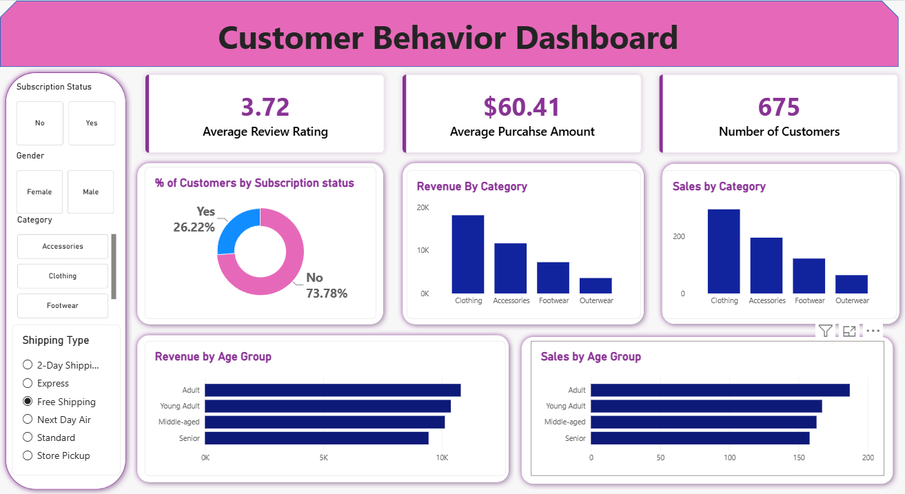

# 🛍️ Customer Shopping Behavior Analysis

## 📌 Project Overview

This project focuses on analyzing customer shopping behavior to uncover insights into purchasing patterns, customer preferences, revenue generation, and product category performance.

The project follows an end-to-end data analytics workflow, starting with raw customer shopping data, cleaning and preprocessing it using Python and Pandas, performing SQL-based analysis, and building an interactive dashboard to visualize key business metrics.

## 🎯 Project Objectives

- Clean and preprocess raw customer shopping data.
- Analyze customer purchasing patterns and preferences.
- Calculate revenue by gender and product category.
- Understand customer subscription behavior.
- Compare sales and revenue across age groups.
- Build an interactive dashboard to support data-driven decision-making.

## 🛠️ Tools & Technologies

- **Python** – Data cleaning and preprocessing
- **Pandas** – Data manipulation and transformation
- **SQL** – Data querying and analysis
- **PostgreSQL** – Database management
- **Power BI** – Interactive dashboard and visualization
- **Jupyter Notebook** – Python development environment

## 📂 Project Structure

```text
Customer-Shopping-Behavior-Analysis/
│
├── customer_shopping_behavior.csv
├── Data_cleaning.ipynb
├── customer_behaviour.sql
├── Customer_Behavior_Dashboard.png
└── README.md
```

## 🔄 Project Workflow

### 1. Data Collection

Started with a customer shopping behavior dataset containing information about customer demographics, purchases, product categories, subscription status, and shipping preferences.

### 2. Data Cleaning Using Python

Used Python and Pandas in Jupyter Notebook to clean and prepare the dataset for analysis.

Key activities included:
- Inspecting the dataset and understanding its structure.
- Checking data quality and identifying missing values.
- Preparing the data for SQL analysis and visualization.

### 3. SQL Analysis

Used SQL queries to explore customer shopping behavior and extract business insights.

Key analysis areas included:
- Revenue generated by male and female customers.
- Customer purchase patterns.
- Product category performance.
- Sales and revenue comparisons.

**SQL concepts:** `SELECT`, `GROUP BY`, aggregate functions, and data analysis queries.

### 4. Dashboard Development

Created an interactive Customer Behavior Dashboard to present important metrics and trends visually.

## 📊 Dashboard Highlights

The dashboard includes the following KPIs and visualizations:

### Key Performance Indicators (KPIs)
- **Average Review Rating:** 3.72
- **Average Purchase Amount:** $60.41
- **Number of Customers:** 675

### Visualizations
- Percentage of customers by subscription status.
- Revenue by product category.
- Sales by product category.
- Revenue by age group.
- Sales by age group.

### Interactive Filters
- Subscription status
- Gender
- Product category
- Shipping type

These filters allow users to explore different customer segments and compare purchasing patterns.

## 🖼️ Dashboard Preview



## 💡 Key Learnings

- Cleaning and preparing datasets using Python and Pandas.
- Writing SQL queries to answer business questions.
- Analyzing customer demographics and purchasing patterns.
- Comparing revenue and sales across categories and age groups.
- Creating interactive dashboards and KPI visualizations.
- Translating raw data into meaningful business insights.

## 🚀 How to Explore This Project

1. Clone or download this repository.
2. Open `Data_cleaning.ipynb` in Jupyter Notebook.
3. Place the CSV dataset in the appropriate working directory.
4. Run the notebook cells to perform the data cleaning workflow.
5. Import the prepared dataset into PostgreSQL.
6. Execute the queries in `customer_behaviour.sql`.
7. Open the dashboard in Power BI to explore the visualizations.

## 👨‍💻 Author

**Shantanu Barde**

Aspiring Data Analyst | Python | Pandas | SQL | Power BI
